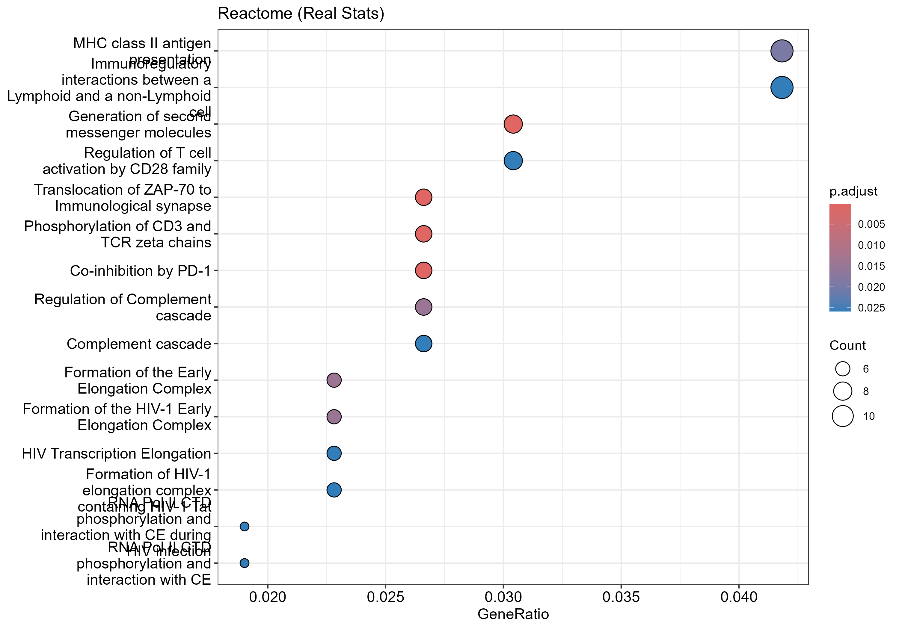
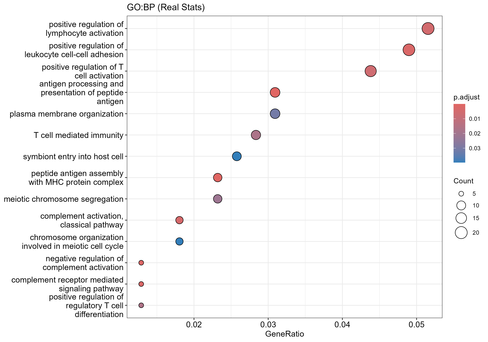
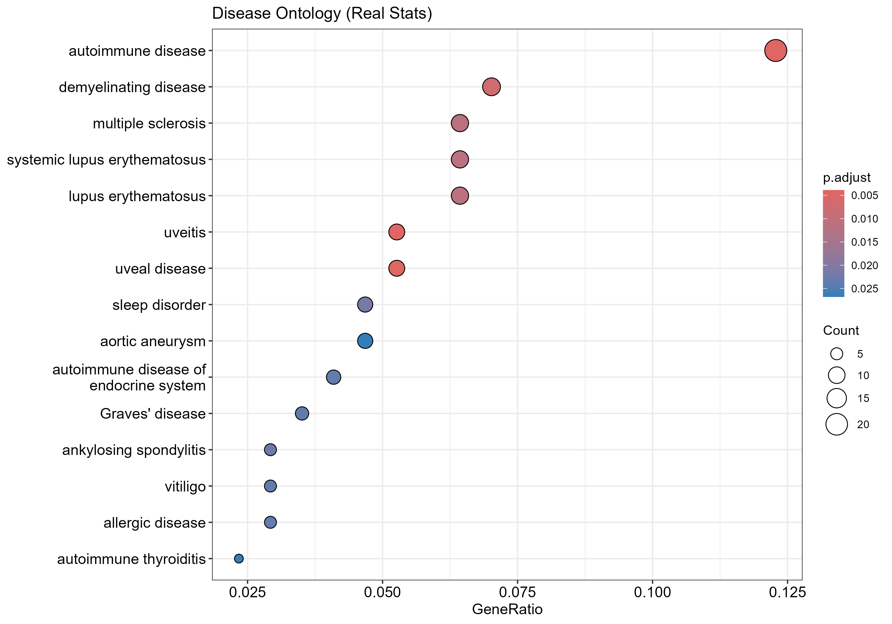
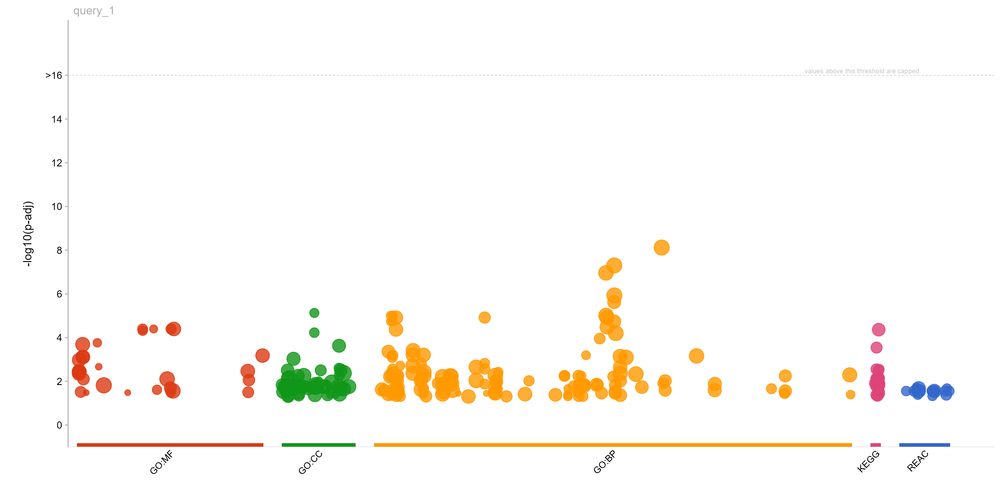
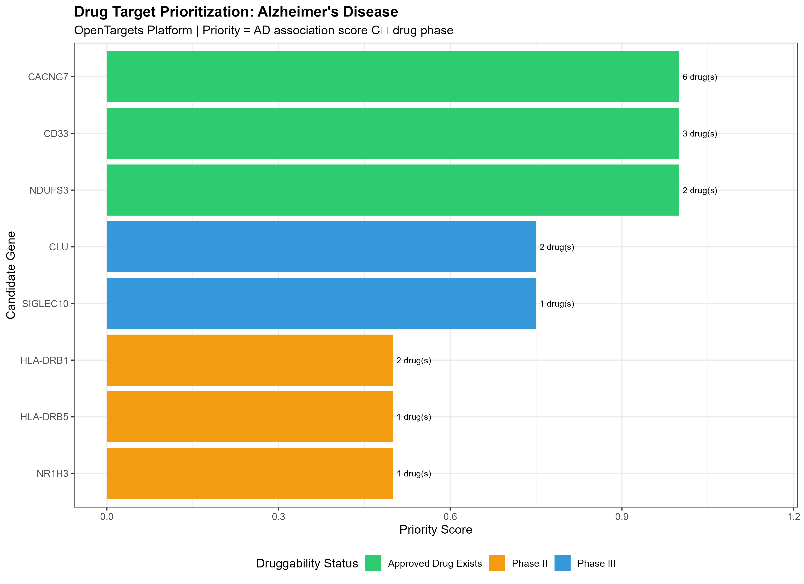
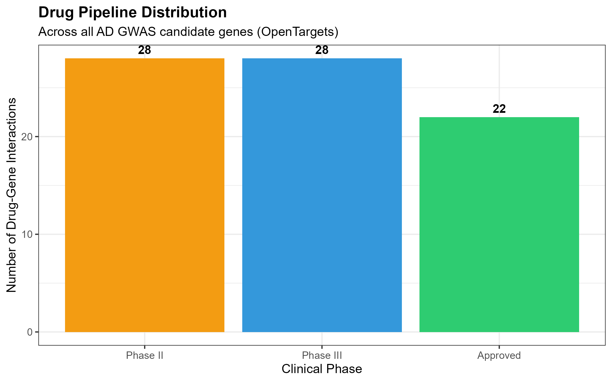
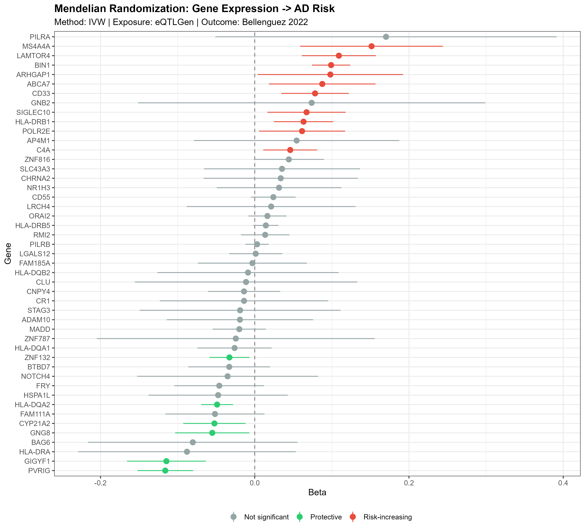
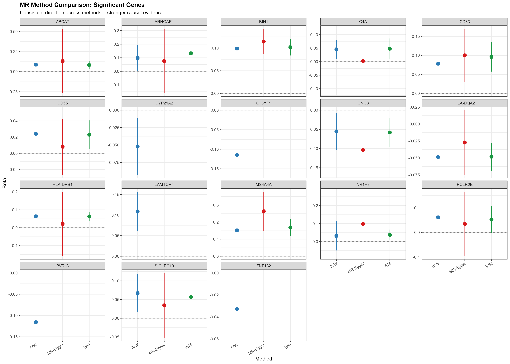

# 🧬 post-gwas-alzheimer


A robust, modular Post-GWAS analysis pipeline focused on **Alzheimer's Disease (AD)**, designed to move from GWAS-significant SNPs to biologically interpretable gene sets, causal genes, and druggable targets.

---

## 📌 Overview

Genome-Wide Association Studies (GWAS) identify statistical associations between genetic variants and traits, but the biological interpretation of these signals requires substantial downstream work. This pipeline bridges that gap for Alzheimer's Disease by:

1. Fetching curated AD risk SNPs from the **NHGRI-EBI GWAS Catalog** (with a robust offline fallback)
2. Mapping SNPs to candidate genes using **brain eQTL data** (Qtlizer)
3. Running **multi-tool enrichment analysis** (Reactome, GO, gProfiler2, enrichR, DOSE)
4. **Colocalization analysis** to identify shared causal variants between GWAS and eQTL signals
5. **Drug target prioritization** using OpenTargets Platform clinical evidence
6. **Mendelian Randomization** to test causal effects of gene expression on AD risk

The pipeline is built with a **hybrid server/backup architecture** — if any external API is unavailable, the analysis continues using curated literature-based data, making it reproducible in any environment.

---

## 🗂️ Repository Structure

```
post-gwas-alzheimer/
│
├── README.md                        # This file
├── Post_GWAS_Analysis_new.R              # Script 1: Hybrid (gene-based, with fallback)
├── Post_GWAS_Analysis_bigdata.R          # Script 2: Big Data (full study download)
├── Post_GWAS_Colocalization_HyPrColoc.R  # Script 3: Standalone colocalization
├── Post_GWAS_SummaryStats_Pipeline.R     # Script 4: Real summary stats (full pipeline)
├── Post_GWAS_DrugTarget_OpenTargets.R    # Script 5: Drug target prioritization
├── Post_GWAS_MendelianRandomization.R    # Script 6: Mendelian Randomization
│
├── methods/                         # Per-tool methodology documentation
│   ├── METHODS_GWAS_Catalog.md
│   ├── METHODS_QTLizer.md
│   ├── METHODS_BigData_Studies.md
│   ├── METHODS_HyPrColoc.md
│   ├── METHODS_ReactomePA.md
│   ├── METHODS_clusterProfiler_GO.md
│   ├── METHODS_gProfiler2.md
│   ├── METHODS_enrichR.md
│   └── METHODS_DOSE.md
│
└── results/                         # Output directory (generated at runtime)
    ├── lead_snps.csv
    ├── qtls_filtered.csv
    ├── gene_mapping.csv
    ├── Reactome_Results.csv
    ├── GO_Results.csv
    ├── gProfiler2_Results.csv
    ├── EnrichR_Results_TopDB.csv
    └── DOSE_Results.csv
```

---

## ⚙️ Pipeline Steps

| Step | Description | Tool |
|------|-------------|------|
| 1 | Fetch GWAS associations for AD risk genes | `gwasrapidd` + GWAS Catalog API |
| 2 | Map SNPs to genes via brain eQTLs | `Qtlizer` |
| 3 | Convert gene symbols to Entrez IDs | `org.Hs.eg.db` + `clusterProfiler::bitr` |
| 4a | Reactome pathway enrichment | `ReactomePA` |
| 4b | GO Biological Process enrichment | `clusterProfiler` |
| 4c | Multi-database enrichment (GO, REAC, KEGG) | `gprofiler2` |
| 4d | Curated library enrichment | `enrichR` |
| 4e | Disease Ontology enrichment | `DOSE` |
| 5 | Colocalization (GWAS + brain eQTLs) | `coloc` |
| 6 | Drug target prioritization & clinical evidence | `OpenTargets API` |
| 7 | Mendelian Randomization (IVW + MR-Egger + WM) | `TwoSampleMR` + `eQTLGen` |

---

## 🚀 Getting Started

### Requirements

- R ≥ 4.2.0
- Bioconductor ≥ 3.16
- Internet connection (optional — pipeline works offline via backup data)

### Installation

```r
# Install CRAN packages
install.packages(c("tidyverse", "gwasrapidd", "httr", "jsonlite",
                   "gprofiler2", "enrichR", "readr", "stringr", "ggplot2"))

# Install Bioconductor packages
if (!require("BiocManager")) install.packages("BiocManager")
BiocManager::install(c("Qtlizer", "clusterProfiler", "org.Hs.eg.db",
                       "enrichplot", "ReactomePA", "DOSE", "AnnotationDbi"))
```

### Which Script to Use?

| | Script 1 | Script 2 | Script 4 | Script 5 | Script 6 |
|---|---|---|---|---|---|
| **Purpose** | Enrichment | Enrichment (full) | Real summary stats | Drug targets | Mendelian Randomization |
| **SNP source** | 19 AD genes | Bellenguez + Kunkle | Bellenguez + Kunkle | Candidate genes | eQTLGen blood eQTLs |
| **Offline fallback** | ✅ Yes | ❌ No | ❌ No | ❌ No | ❌ No |
| **Speed** | Fast | Slow | Slow | Fast | Moderate |
| **Use when** | First-pass | Full coverage | Full meta-analysis | Drug prioritization | Causal inference |

### Run

```r
# Step 1: Enrichment analysis (recommended starting point)
source("Post_GWAS_Analysis_new.R")

# Step 2: Real summary stats meta-analysis + colocalization
source("Post_GWAS_SummaryStats_Pipeline.R")

# Step 3: Drug target prioritization
source("Post_GWAS_DrugTarget_OpenTargets.R")

# Step 4: Mendelian Randomization (requires OpenGWAS token)
Sys.setenv(OPENGWAS_JWT = "YOUR_TOKEN_HERE")
source("Post_GWAS_MendelianRandomization.R")
```

Results will be saved to `~/Documents/run_results/` by default. Change the `work_dir` parameter at the top of the script to modify this.

### Key Parameters

```r
trait          <- "Alzheimer_Hybrid_Analysis"
pval_threshold <- 5e-8      # GWAS significance threshold
ld_method      <- "r2"      # LD correlation method
ld_corr        <- 0.8       # LD r² cutoff
qtl_tissue     <- "Brain"   # Tissue filter for eQTL mapping
```

---

## 🧪 Target Genes

The pipeline queries associations for 19 well-established AD GWAS risk genes:

`APOE`, `BIN1`, `CLU`, `ABCA7`, `CR1`, `PICALM`, `MS4A6A`, `CD33`, `MS4A4E`, `CD2AP`, `EPHA1`, `INPP5D`, `MEF2C`, `TREM2`, `SORL1`, `PLCG2`, `ADAM10`, `ACE`, `TOMM40`

---

## 📊 Results

Analysis performed on real GWAS summary statistics from **Bellenguez et al. 2022** (GCST90027158) and **Kunkle et al. 2019** (GCST007320), combined via inverse-variance weighted meta-analysis.

### Reactome Pathway Enrichment


### GO Biological Process Enrichment


### Disease Ontology Enrichment


### Multi-Database Enrichment (gProfiler2)


### Drug Target Prioritization: Priority Ranking


### Drug Target Prioritization: Clinical Phase Distribution


### Mendelian Randomization: IVW Forest Plot


### Mendelian Randomization: Method Comparison


---

## 🔭 Future Directions

The pipeline currently implements a comprehensive set of post-GWAS analyses. Potential extensions include:

### 🧠 Cell-Type-Specific Enrichment (`MAGMA Celltyping`)
Integrate GWAS summary statistics with single-cell RNA-seq signatures (e.g. Allen Brain Atlas, Human Cell Atlas) to identify which brain cell types — microglia, astrocytes, excitatory neurons — are most enriched for AD heritability.

### 🔁 Multi-trait Colocalization (`HyPrColoc`)
Extend the current pairwise `coloc` analysis to simultaneous multi-trait colocalization across multiple AD-related phenotypes.

---

## 📚 Methods

Detailed documentation for each tool used in this pipeline is available in the [`methods/`](methods/) directory.

---

## 📄 License

MIT License — free to use, adapt, and distribute with attribution.

---

## 🙋 Author

Contributions and feedback welcome. Please open an issue or submit a pull request.
